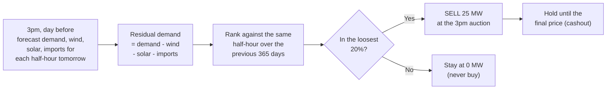

# Decision memo: sell at 3pm only when supply is loose

*3pm bet · 25 MW limit · data 31 Dec 2016 to 2 Oct 2026 (169,943 half-hours) · every £ figure is for a 25 MW position, before trading costs*

## 1. Hypothesis

**When forecast residual demand (demand minus wind, solar and imports) is unusually high for that time of day, the final price (cashout) will settle above the 3pm half-hourly auction price, so we buy 25 MW at 3pm; when it is unusually low, cashout will settle below, so we sell 25 MW, because a tight system leaves the day-ahead auction under-pricing the cost of balancing, and a loose one leaves it over-pricing it.**

**Why this one:** residual demand is the most direct measure of how hard the grid has to work, and it uses only day-ahead forecasts (no peeking). It is also simple enough to explain and to switch off. "Unusual" means ranked against the same half-hour of the day over the previous 365 days, so winter evenings are not mistaken for tight supply. The bet is the **3pm one**: profit = 0.5 × MW × (cashout − 3pm price).

**What the test found:** the *selling* half holds up. The *buying* half does not.

## 2. Recommendation

**Run the sell-only version: sell 25 MW at 3pm in half-hours where forecast residual demand is in the loosest 20% for that time of day; otherwise stay at 0 MW; never buy. Start small and scale up (see section 4).** It is the selling half of the original rule, so it adds no new tuned numbers.

| 3pm bet, all years | Total profit | Without 2021-22 | Worst day | Biggest fall from a peak | Risk-adjusted score* |
|---|---:|---:|---:|---:|---:|
| **Recommended: sell only when loose** | **£1,133k** | **£790k** | **-£40k** | **-£132k** | **1.26** |
| Original: buy when tight, sell when loose | £1,265k | £955k | -£108k | -£344k | 0.60 |
| Always sell 25 MW | £2,547k | £963k | -£429k | -£668k | 0.81 |
| Always buy 25 MW | -£2,547k | -£963k | -£168k | -£2,700k | -0.81 |
| Do nothing | £0 | £0 | £0 | £0 | n/a |

\*Average daily profit divided by its day-to-day swing, scaled to a year (a Sharpe ratio). Higher is steadier.

**Why this over the alternatives**

- **Loose supply does lower the final price.** In the loosest 20% of half-hours the final price averaged **£2.19/MWh below** the 3pm price (uncertainty ±£1.23); in the tightest 20% it averaged £0.35 *above*, with an uncertainty (±£1.88) that spans zero.
- **It makes money in every calendar year** (2016 is a single day), including without 2021-22, and in both halves of the sample: £575k up to 2021, £558k since 2022.
- **It is not a bet on the gas crisis.** Only 30% of its profit came from 2021-22; for always-sell it was 62%.
- **The buying leg is the weak part.** It made £132k in total against £1,133k from selling, and lost money in 2019, 2021 and 2024 (-£51k, -£251k, -£123k).

## 3. Trade-offs

**Gained:** a worst day of -£40k (always-sell: -£429k) and a biggest fall of -£132k (always-sell: -£668k). Profit in every calendar year (2016 is a single day). Roughly a quarter of half-hours traded (41,306 of 169,943).

**Sacrificed:** more than half the profit. Always selling made £2.55m against £1.13m. **Always selling beat this strategy on total profit and we are not claiming otherwise.** The case for the recommendation is steadiness, not size.

**Assumptions it rests on**
1. The third-party forecasts were published before the 9am auction (stated in `docs/CHALLENGE.md`; the files cannot prove it, as `downloaded_at_utc` is a bulk download time).
2. We are filled at the 3pm clearing price with **no trading costs**. Average profit is **£2.19 per MWh sold, which is the break-even cost per MWh**. 25 MW is 12.5 MWh per half-hour, about 1.6% of the median auction volume (if the volume column is in MWh).
3. The standing gap persists: across *all* half-hours the final price was £1.20/MWh **below** the 3pm price. Most of the profit of any seller comes from this gap; the signal tells us when it is widest. **This is the biggest uncertainty, as residual demand does not explain why the gap exists.**
4. Short positions carry spike risk. A +£1,000/MWh surprise costs £12,500 in one half-hour at 25 MW. The cashout price reached £4,038/MWh in the data.

**Rejected or parked** (alternatives were tried *after* seeing full-sample results, so their scores are flattered):

| Alternative | Result | Why not |
|---|---|---|
| Original buy-and-sell rule | £1,265k, worst day -£108k | Buying leg is unreliable and the biggest fall is 2.6 times larger |
| Sell in the loosest 40% | £1,887k, Sharpe 1.55, fall -£165k | Looks better, but the 40% cut-off was picked after seeing results; test it live next |
| Sell more as supply gets looser (scaled) | £1,901k, Sharpe 1.39, fall -£264k | Same issue, and a bigger worst day (-£172k) |
| Sell everything except the tightest 20% | £2,679k, worst day -£428k | Same risk profile as always-sell |
| Add a gas-cost filter (3pm price vs SRMC) | £660k, Sharpe 1.61, fall -£66k | Trades only 10% of half-hours and weaker since 2022 (£240k); an extra tuned input |
| Always sell | £2,547k | Biggest profit, but 62% of it from 2021-22 and a -£668k drawdown |

## 4. Metrics and kill conditions

**Roll-out:** 4 weeks paper trading, then 10 MW, then 25 MW only if the "green" row below holds. Thresholds are judgement-based multiples of the history, not statistical results.

| Measure (live) | 🟢 Keep going | 🟡 Halve the size and review | 🔴 Stop and revisit |
|---|---|---|---|
| Profit per MWh sold, last 90 days (history: £2.19) | above £1.10 | £0 to £1.10 | below £0 for 180 days |
| Biggest fall from a peak (history: -£132k at 25 MW) | better than -£130k | -£130k to -£200k | worse than -£200k |
| Worst single day (history: -£40k) | better than -£60k | -£60k to -£80k | worse than -£80k |
| Half-hours won when trading (history: 53.8%) | above 50% | 47% to 50% | below 47% for 6 months |
| Loosest-20% group vs tightest-20% group, average final-minus-3pm price | loosest is lower | gap under £1 | loosest is higher |

**Revisit immediately if:** any forecast turns out to be published after 3pm; a forecast feed changes or is missing for more than 5% of half-hours; or the rules for calculating cashout change.

**Reproduce:** `pip install -r requirements.txt` then `python src/residual_demand_strategy.py` (see `README.md`). Interactive month/year view: `results/residual_demand/dashboard.html`.
