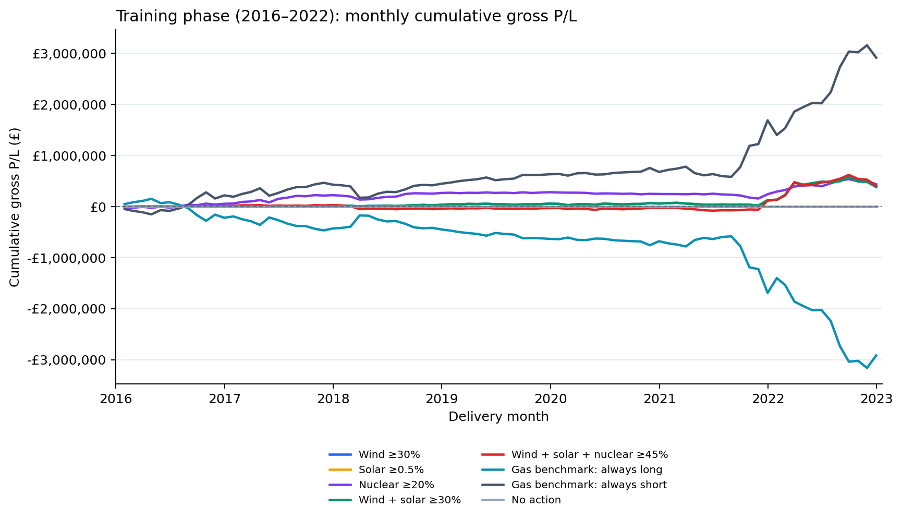
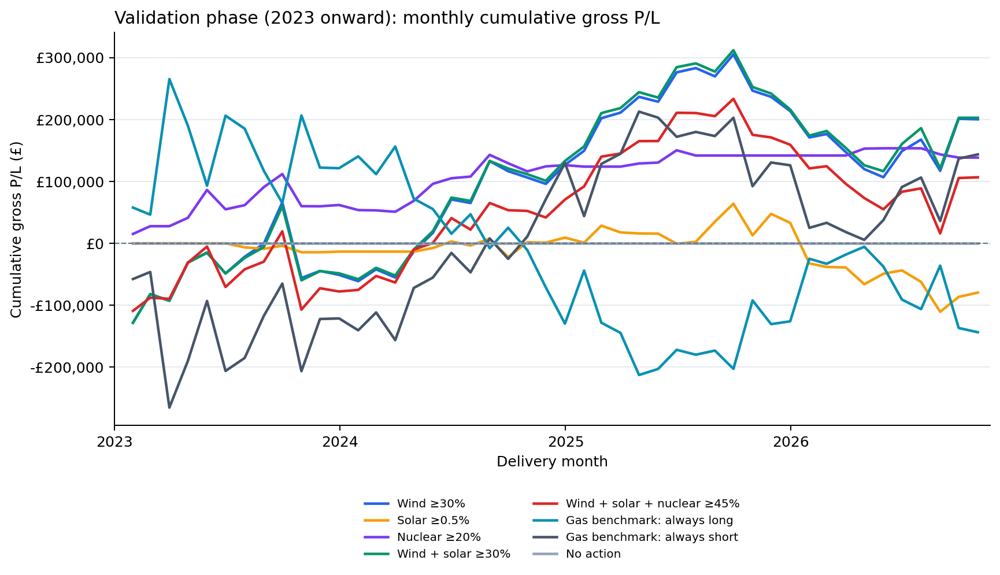

# Decision memo: GB generation-signal strategy

**Decision date:** 3 October 2026  
**Sample:** 3,925 complete delivery days, 2016–2 October 2026  
**Scope:** Historical, gross P/L; positions capped at ±25 MW.

## Recommendation

**Do not deploy a generation-triggered strategy yet.** Prioritize the
wind-short, nuclear-short, and solar-long directions for a pre-registered,
out-of-sample paper test with execution costs; park their opposite directions
unless new evidence supports them. Unconditional short power outperformed
each signal-conditioned rule in gross P/L, so this sample does not establish
a persistent or deployable edge.

## Evidence

The rules below take the indicated position only when the generation-share
threshold is active; otherwise they are flat. Long and short results are
opposite for the same active observations.

| Strategy | Gross P/L |
|---|---:|
| Wind ≥30% — short when active | £583,238 |
| Wind ≥30% — long when active | −£583,238 |
| Solar ≥0.5% — short when active | −£79,679 |
| Solar ≥0.5% — long when active | £79,679 |
| Nuclear ≥20% — short when active | £575,566 |
| Nuclear ≥20% — long when active | −£575,566 |
| Gas-referenced power — always short 25 MW | £3,059,606 |
| Gas-referenced power — always long 25 MW | −£3,059,606 |
| No action — flat | £0 |

The gas-referenced benchmarks are unconditional power positions evaluated
with the challenge's power P/L formula; they are not gas-commodity trades.

## Historical gross P/L by phase

Monthly P/L is accumulated from £0 separately in each phase. Validation starts
on 1 January 2023. This is a retrospective time split, not a strict untouched
holdout: strategy research used the historical sample.

<table>
<tr>
<td><strong>Training phase: before 2023</strong><br></td>
<td><strong>Validation phase: 2023 onward</strong><br></td>
</tr>
</table>

See the detailed charts and annual results in
[`GA_analysis/wind_hypothesis_backtest.html`](GA_analysis/wind_hypothesis_backtest.html)
and [`GA_analysis/wind_hypothesis_annual_pnl.csv`](GA_analysis/wind_hypothesis_annual_pnl.csv).

## Reproduce from a fresh clone

The market, fuel-price, and forecast input files are included in the repository
under `data/`; no additional data download or API credentials are required.
Use Python **3.12.15** and the pinned dependencies in
[`requirements.txt`](requirements.txt).

macOS / Linux:

```bash
git clone --branch GA --single-branch https://github.com/recentlyhatched/advanced-challenge-grid-volatility.git
cd advanced-challenge-grid-volatility
git branch --show-current
python3.12 -m venv .venv
source .venv/bin/activate
python -m pip install -r requirements.txt
python GA_analysis/wind_hypothesis_backtest.py
```

Windows PowerShell:

```powershell
git clone --branch GA --single-branch https://github.com/recentlyhatched/advanced-challenge-grid-volatility.git
cd advanced-challenge-grid-volatility
git branch --show-current
py -3.12 -m venv .venv
.\.venv\Scripts\Activate.ps1
python -m pip install -r requirements.txt
python GA_analysis/wind_hypothesis_backtest.py
```

Run the backtest command from the repository root. It regenerates the HTML
report, annual P/L CSV, and both phase PNGs in `GA_analysis/`. By default, the
sample ends on **2 October 2026**; to use another date covered by the local
data, append `--end-date YYYY-MM-DD`.
The clone command checks out the `GA` branch; `git branch --show-current`
should print `GA` before you continue.

## Trade-offs, metrics, and kill conditions

High wind and nuclear short rules were profitable in-sample, while the solar
short rule lost money. The always-short benchmark made substantially more,
but carries unconditional exposure and large drawdowns. No transaction costs,
slippage, or market impact are included; a flat position avoids those costs
but forgoes any market return.

Proceed only to paper testing. Before that test, specify costs and risk limits.
Continue only if **out-of-sample, after-cost P/L is positive**, exceeds the
no-action baseline, and is competitive with matched always-long/short
benchmarks without breaching the pre-set drawdown limit. Stop or revise the
strategy if net P/L is non-positive, performance fails to beat no action, or
the drawdown limit is breached. Reproduce the report with
`python GA_analysis/wind_hypothesis_backtest.py`; setup is in [`README.md`](README.md).
