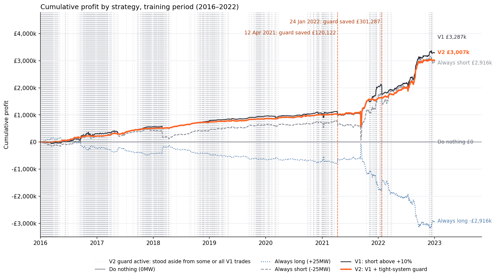
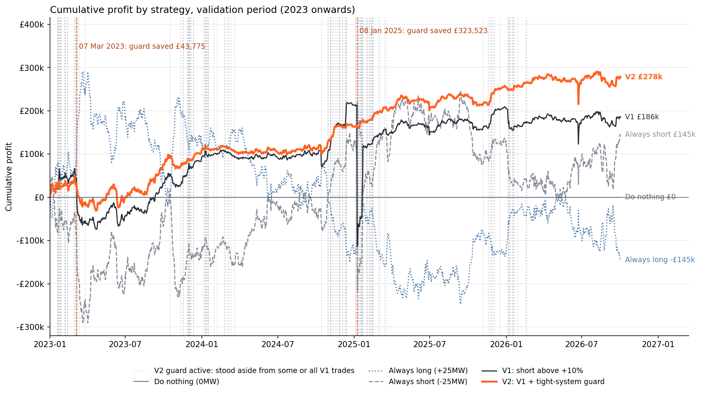
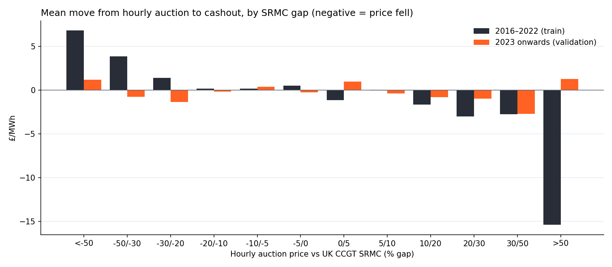

# Results

Generated by `run.py`. All figures are frictionless (no fees or slippage) at ±25MW, held from the 09:00
hourly auction to cashout. P&L uses the brief's formula and is summed per UTC delivery day.

## Parameters

- V1 entry: hourly price more than 10% above UK CCGT SRMC → short 25MW.
- V2 guard: stand aside when forecast demand minus forecast wind exceeds **34,039 MW** (the 80% percentile of V1-signal half-hours, fitted on 2016-01-01–2022-12-31 only).
- Guard blocks 20.0% of V1 signal half-hours in train and 7.4% in validation.

## Validation period (2023 onwards, untouched during fitting)

| strategy | total_pnl_gbp | net_of_always_short_gbp | sharpe_annualised | max_drawdown_gbp | worst_day_gbp | worst_day | worst_week_gbp | profitable_days_pct | hit_rate_halfhours_pct | time_in_market_pct |
|---|---|---|---|---|---|---|---|---|---|---|
| Do nothing (0MW) | £0 | -£145,009 | – | £0 | £0 | – | – | – | – | 0.0% |
| Always long (+25MW) | -£145,009 | -£290,019 | -0.15 | -£537,629 | -£73,766 | 2025-01-22 | -£174,390 | 48.1% | 48.3% | 100.0% |
| Always short (-25MW) | £145,009 | £0 | 0.15 | -£369,163 | -£320,262 | 2025-01-08 | -£292,871 | 51.9% | 51.6% | 100.0% |
| V1: short above +10% | £185,559 | £40,550 | 0.25 | -£332,432 | -£326,722 | 2025-01-08 | -£279,474 | 50.7% | 42.9% | 22.0% |
| V2: V1 + tight-system guard | £278,083 | £133,074 | 1.18 | -£78,486 | -£47,481 | 2026-06-23 | -£29,587 | 50.6% | 42.1% | 20.4% |

## Training period (2016–2022)

| strategy | total_pnl_gbp | net_of_always_short_gbp | sharpe_annualised | max_drawdown_gbp | worst_day_gbp | worst_day | worst_week_gbp | profitable_days_pct | hit_rate_halfhours_pct | time_in_market_pct |
|---|---|---|---|---|---|---|---|---|---|---|
| Do nothing (0MW) | £0 | -£2,915,848 | – | £0 | £0 | – | – | – | – | 0.0% |
| Always long (+25MW) | -£2,915,848 | -£5,831,697 | -1.16 | -£3,321,190 | -£192,854 | 2021-09-16 | -£513,925 | 44.2% | 44.2% | 100.0% |
| Always short (-25MW) | £2,915,848 | £0 | 1.16 | -£727,332 | -£408,774 | 2021-09-09 | -£433,927 | 55.8% | 55.7% | 100.0% |
| V1: short above +10% | £3,286,799 | £370,951 | 1.53 | -£571,838 | -£406,495 | 2021-09-09 | -£424,770 | 60.6% | 53.1% | 43.3% |
| V2: V1 + tight-system guard | £3,007,014 | £91,166 | 1.80 | -£550,520 | -£406,495 | 2021-09-09 | -£424,770 | 59.9% | 51.3% | 34.6% |

## Full period

| strategy | total_pnl_gbp | net_of_always_short_gbp | sharpe_annualised | max_drawdown_gbp | worst_day_gbp | worst_day | worst_week_gbp | profitable_days_pct | hit_rate_halfhours_pct | time_in_market_pct |
|---|---|---|---|---|---|---|---|---|---|---|
| Do nothing (0MW) | £0 | -£3,060,858 | – | £0 | £0 | – | – | – | – | 0.0% |
| Always long (+25MW) | -£3,060,858 | -£6,121,716 | -0.87 | -£3,321,190 | -£192,854 | 2021-09-16 | -£513,925 | 45.6% | 45.6% | 100.0% |
| Always short (-25MW) | £3,060,858 | £0 | 0.87 | -£727,332 | -£408,774 | 2021-09-09 | -£433,927 | 54.4% | 54.3% | 100.0% |
| V1: short above +10% | £3,472,358 | £411,500 | 1.18 | -£571,838 | -£406,495 | 2021-09-09 | -£424,770 | 57.3% | 50.9% | 35.8% |
| V2: V1 + tight-system guard | £3,285,097 | £224,239 | 1.55 | -£550,520 | -£406,495 | 2021-09-09 | -£424,770 | 56.7% | 49.1% | 29.6% |

## Robustness checks (validation period)

| strategy | as_tested_total_gbp | excl_2025-01-08_total_gbp | executed_at_3pm_total_gbp | executed_at_3pm_sharpe | executed_at_3pm_max_drawdown_gbp |
|---|---|---|---|---|---|
| Always short (-25MW) | £145,009 | £465,272 | £458,502 | 0.50 | -£348,408 |
| V1: short above +10% | £185,559 | £512,281 | £127,933 | 0.18 | -£327,896 |
| V2: V1 + tight-system guard | £278,083 | £281,281 | £195,842 | 0.88 | -£79,410 |

## Kill-condition monitor for V2 (see DECISION_MEMO.md)

The limits are judgement calls, shown against both periods so their behaviour is visible. The 12-month window for K3 was chosen over 6 months because 6 months fired on 197 validation days, too often to act on.

| period | condition | description | days_breached | first_breach | last_breach |
|---|---|---|---|---|---|
| train | K1_daily_loss | Stop: single-day loss worse than -£100,000 | 2 | 2021-09-07 | 2021-09-09 |
| train | K2_drawdown | Stop: drawdown from peak worse than -£150,000 | 8 | 2021-09-09 | 2022-07-12 |
| train | K3_rolling_pnl_negative | Review: rolling 365-day P&L below zero | 6 | 2021-09-09 | 2021-09-14 |
| train | K4_guard_miss | Review: day worse than -£40,000 that the guard let through | 5 | 2021-09-07 | 2022-08-11 |
| validation | K1_daily_loss | Stop: single-day loss worse than -£100,000 | 0 |  |  |
| validation | K2_drawdown | Stop: drawdown from peak worse than -£150,000 | 0 |  |  |
| validation | K3_rolling_pnl_negative | Review: rolling 365-day P&L below zero | 1 | 2026-06-23 | 2026-06-23 |
| validation | K4_guard_miss | Review: day worse than -£40,000 that the guard let through | 1 | 2026-06-23 | 2026-06-23 |

## Evidence for the hypothesis: mean move from hourly auction to cashout (£/MWh) by SRMC gap

| gap_pct_bucket | train | validation |
|---|---|---|
| <-50 | 6.82 | 1.19 |
| -50/-30 | 3.86 | -0.77 |
| -30/-20 | 1.40 | -1.35 |
| -20/-10 | 0.18 | -0.17 |
| -10/-5 | 0.16 | 0.38 |
| -5/0 | 0.51 | -0.23 |
| 0/5 | -1.14 | 0.96 |
| 5/10 | -0.03 | -0.36 |
| 10/20 | -1.63 | -0.79 |
| 20/30 | -3.02 | -0.95 |
| 30/50 | -2.74 | -2.70 |
| >50 | -15.39 | 1.27 |

## Charts

Interactive version: `interactive_charts.html` in this folder.
